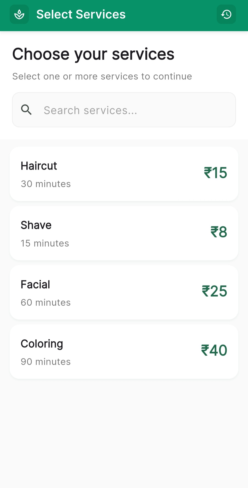
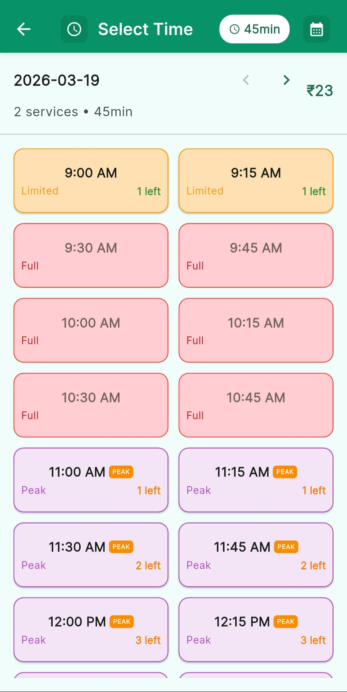
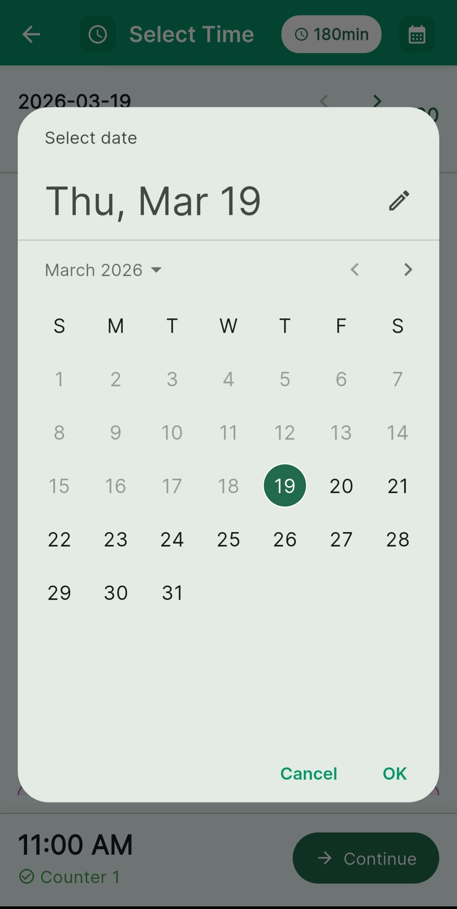
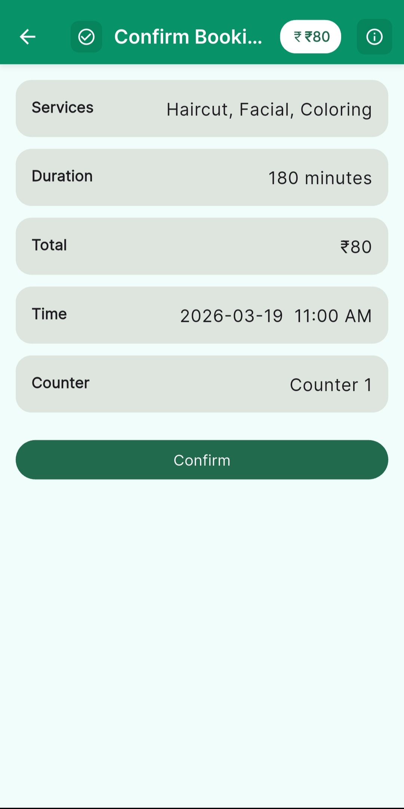
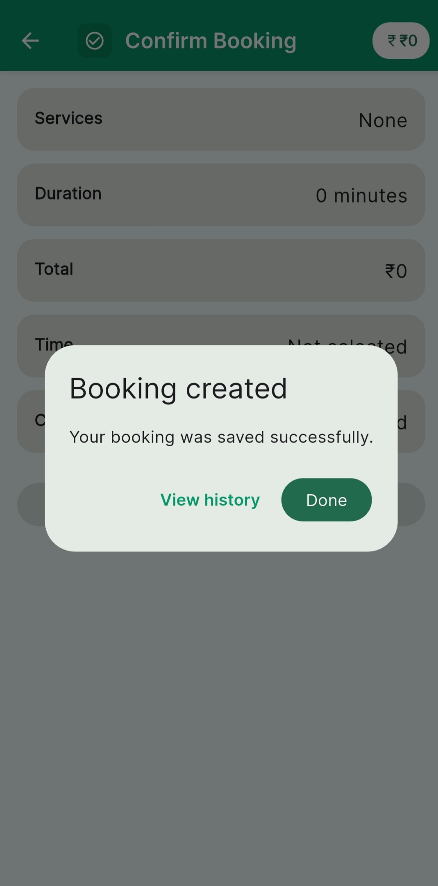
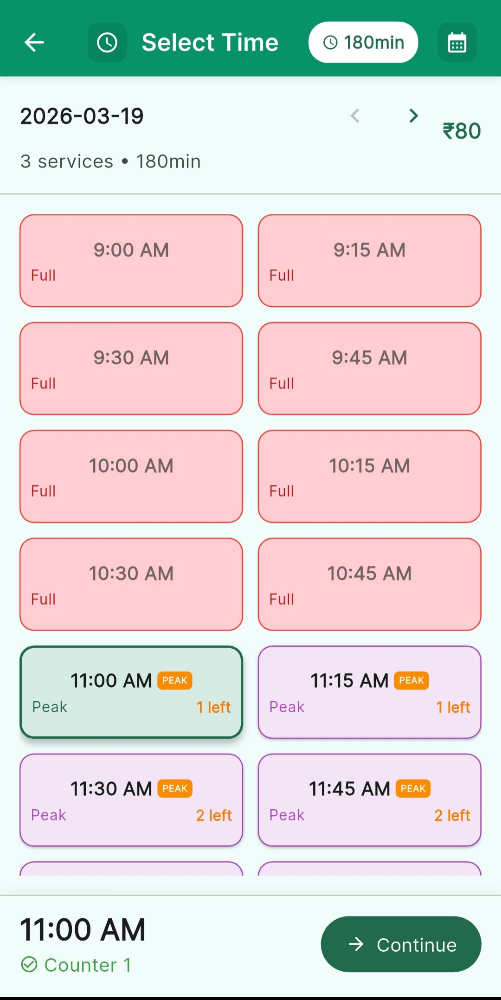
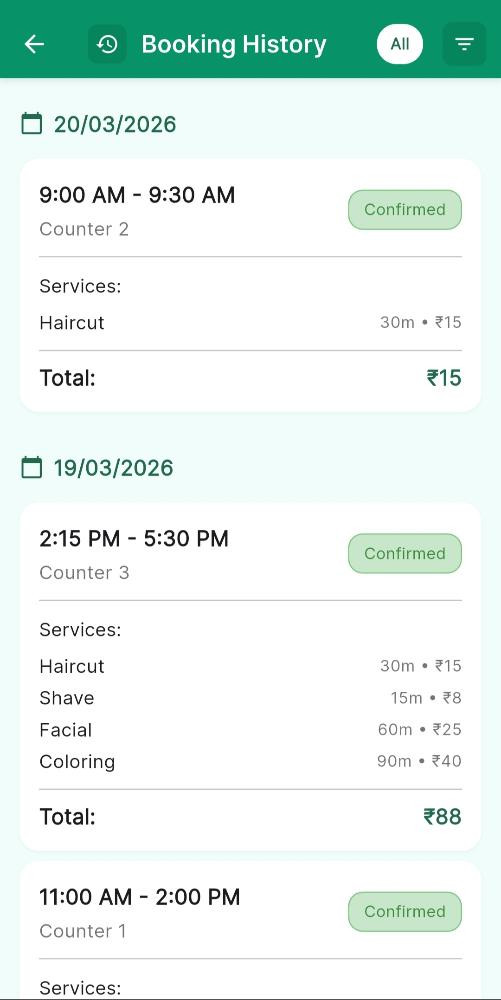

# OmniBooking - Multi-Counter Service Booking System

A sophisticated Flutter application for service-based businesses that manages appointments across multiple independent service counters. Built with modern architecture and real-time availability calculation.

## 🚀 Overview

OmniBooking solves the complex challenge of managing appointments across multiple service counters while ensuring optimal resource allocation. The app provides real-time availability calculations based on service duration combinations and counter occupancy.

## ✨ Key Features

### 🛍️ Smart Service Selection
- **Multi-service basket** with dynamic price and duration calculation
- **Live updates** as services are added/removed
- **Search functionality** for easy service discovery
- **Visual selection indicators** with clear pricing

### 🕒 Intelligent Time Slot Management
- **Real-time availability** across 3 independent counters
- **15-minute interval slots** from 9:00 AM to 6:00 PM
- **Dynamic slot blocking** based on total service duration
- **Capacity indicators** showing available counters ("2 left", "1 left")
- **Peak time highlighting** for busy periods

### 📱 Modern User Experience
- **Material Design 3** with professional emerald theme
- **Responsive navigation** with overflow protection
- **Date navigation** with prev/next controls
- **Booking history** with smart filtering (Today, Week, Month, All)
- **Offline capability** with local data persistence

## 📸 Screenshots

| Service Selection | Multiple Services | Time Slots |
|:---:|:---:|:---:|
|  |  |  |

| Date Selection | Booking Preview | Booking Success |
|:---:|:---:|:---:|
|  |  |  |

| Slot Selection | Time Availability | Booking History |
|:---:|:---:|:---:|
|  |  |  |

## 🏗️ Technical Architecture

### **Frontend**
- **Flutter** (Latest Stable) with Material Design 3
- **Riverpod** for robust state management
- **Google Fonts** for professional typography

### **Backend & Data**
- **Firebase Firestore** for cloud data persistence
- **Offline-first architecture** with local caching
- **Real-time synchronization** when online

### **Core Algorithm**
The heart of the application lies in the **Slot Finder Algorithm** (`lib/utils/slot_finder.dart`):

```dart
// Simplified core logic
for (var counterId = 0; counterId < counters; counterId++) {
  final hasOverlapOnThisCounter = existingBookings
      .where((b) => b.counterId == counterId)
      .any((b) => bookingOverlapsRange(b, proposedTimeRange));
  
  if (!hasOverlapOnThisCounter) {
    // Counter is free - slot is available
    return TimeSlot(isAvailable: true, counterId: counterId);
  }
}
```

## 📊 Data Models

### Services Collection
```json
{
  "name": "Haircut",
  "durationMinutes": 30,
  "priceCents": 1500
}
```

### Bookings Collection
```json
{
  "startAt": "2026-03-19T10:00:00.000Z",
  "durationMinutes": 60,
  "counterId": 1,
  "serviceIds": ["haircut", "facial"],
  "totalPriceCents": 4000
}
```

## 🧪 Testing & Quality Assurance

### **Assignment Requirements Validation**
✅ **Mock Data Testing**: Implements exact assignment dataset
- Counter 1: 10:00 AM – 11:00 AM
- Counter 2: 10:30 AM – 11:30 AM  
- Counter 3: 09:00 AM – 10:30 AM

✅ **Critical Test Case**: 60-minute service at 10:00 AM correctly shows as unavailable

### **Unit Testing**
```bash
flutter test test/slot_finder_test.dart
```

## 🚀 Getting Started

### Prerequisites
- Flutter SDK (3.0.0 or higher)
- Dart SDK (3.0.0 or higher)
- Firebase project (optional - app works offline)

### Installation

1. **Clone the repository**
```bash
git clone https://github.com/your-repo/omnibooking.git
cd omnibooking
```

2. **Install dependencies**
```bash
flutter pub get
```

3. **Run the application**
```bash
flutter run
```

The app will work immediately with mock data and offline functionality.

## 🎯 Core Algorithm: Multi-Counter Availability

### **The Challenge**
Determining if a time slot is available when:
- Multiple services with different durations are selected
- 3 independent counters operate simultaneously
- Existing bookings create complex overlap patterns

### **The Solution**
Our algorithm uses **half-open time ranges** `[start, end)` to detect overlaps:

1. **Calculate total duration** from selected services
2. **For each proposed start time**:
   - Calculate end time (start + total duration)
   - Check each counter for overlapping bookings
   - If any counter is free for the entire duration → Slot Available
3. **Assign counter ID** for booking confirmation

### **Overlap Detection Formula**
```
Two time ranges overlap if:
(StartA < EndB) AND (EndA > StartB)
```

## 🛠️ Development

### **Project Structure**
```
lib/
├── models/          # Data models (Service, Booking, TimeSlot)
├── providers/       # Riverpod state management
├── screens/         # UI screens
├── widgets/         # Reusable components
├── utils/           # Core algorithms and utilities
└── theme/           # App theming and colors
```

### **Key Files**
- `lib/utils/slot_finder.dart` - Core availability algorithm
- `lib/utils/demo_existing_bookings.dart` - Assignment mock data
- `lib/providers/selected_services_provider.dart` - Service basket logic
- `lib/screens/time_slots_screen.dart` - Time slot grid UI

## 📋 Business Rules

- **Operating Hours**: 9:00 AM - 6:00 PM
- **Slot Intervals**: 15 minutes
- **Counter Count**: 3 independent stations
- **Peak Hours**: 11:00 AM - 2:00 PM (visual indicators)
- **Booking Limit**: No same-time double-booking per counter

## 🎨 AI Usage Disclosure

This application was developed with assistance from AI coding tools:

- **GitHub Copilot CLI**: Used for code scaffolding, UI improvements, and state management setup
- **Code Architecture**: Human-designed with AI assistance for implementation details  
- **Algorithm Logic**: Core slot-finding algorithm verified and tested by human developer
- **UI/UX Design**: AI-assisted styling with human oversight for professional appearance

All AI-generated code was reviewed, tested, and integrated by the development team to ensure quality and correctness.

## 📄 License

This project is licensed under the MIT License - see the [LICENSE](LICENSE) file for details.

## 🤝 Contributing

1. Fork the repository
2. Create a feature branch (`git checkout -b feature/amazing-feature`)
3. Commit your changes (`git commit -m 'Add amazing feature'`)
4. Push to the branch (`git push origin feature/amazing-feature`)
5. Open a Pull Request

---

**Built with using Flutter & Firebase**